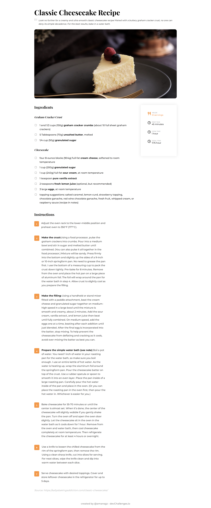

<h1 align="center">Recipe Page</h1>

  This application/site was created as a submission to <a href="https://devchallenges.io/paths/responsive-web-developer">Devchallenges</a> 

  <h3>
    <a href="https://amansgz.github.io/css-recipe-page/">
      Demo
    </a>
     | 
    <a href="https://devchallenges.io/solutions/MFLuU88pMbRWbH5Eb1F7">
      Solution
    </a>
     | 
    <a href="https://devchallenges.io/challenges/OEKdUZ6xs0h99C38XVht">
      Challenge
    </a>
  </h3>

## The challenge

- User story: I can see a page following the given design
- User story: I can select a checkbox if I have the ingredients
- User story: I can see the number of servings, baking times

## Built With

- CSS

## Author

- GitHub [@amansgz](https://github.com/amansgz)
- DevChallenges [@amansgz](https://devchallenges.io/portfolio/amansgz)